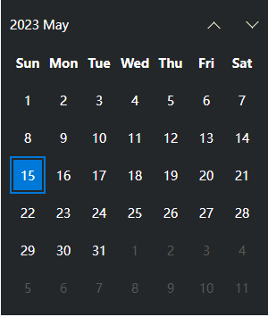
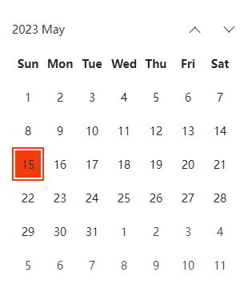

# es-calendar 日历组件

<p align="center">
	<a href="https://www.npmjs.com/package/commander" target="_blank">
		
	</a>
	<a href="https://www.npmjs.com/package/inquirer" target="_blank">
		
	</a>
</p>
<p>&nbsp;</p>

## 介绍

基于 vue3.x + CompositionAPI + typescript + vite + dayjs 模拟windows的日历效果，支持主题切换，自定义高亮颜色、mask区域

## 目标效果展示

- 默认



- 切换主题、颜色



- mask高亮颜色


[源码地址](https://github.com/vangleer/es-calendar)

## 使用说明

### 安装依赖

```
npm i es-calendar
```

### 全局注册

```typescript
import { createApp } from 'vue'
import App from './App.vue'

import 'es-calendar/dist/style.css'
import Calendar from 'es-calendar'

createApp(App)
  .component('es-calendar', Calendar)
  .mount('#app')
```

- 使用

```html
<template>
  <es-calendar v-model="date" />
</template>
<script lang="ts" setup>
import { ref } from 'vue'

const date = ref(new Date())
</script>
```

### 组件中直接使用

```html
<template>
  <Calendar v-model="date" />
</template>

<script setup lang='ts'>
import Calendar from 'es-calendar'
import { ref } from 'vue'

const date = ref(new Date())
</script>
```

### 浏览器直接引入

直接通过浏览器的 HTML 标签导入 es-drager，然后就可以使用全局变量 ESDrager 了。

```html
<!DOCTYPE html>
<html lang="en">
<head>
  <meta charset="UTF-8">
  <meta http-equiv="X-UA-Compatible" content="IE=edge">
  <meta name="viewport" content="width=device-width, initial-scale=1.0">
  <link rel="stylesheet" href="https://unpkg.com/es-calendar/lib/style.css">
  <title>Document</title>
</head>
<body>
  <div id="app">
    <es-calendar>calendar</es-calendar>
  </div>

  <script src="https://unpkg.com/vue@3/dist/vue.global.js"></script>
  <script src="https://unpkg.com/es-calendar"></script>
  <script>
    const { createApp } = Vue
    const app = createApp({})
    app.use(ESCalendar)
    app.mount('#app')
  </script>
</body>
</html>

```

## Drager API

### Drager 属性

| 属性名                   | 说明           | 类型                                         | 默认    |
| --------------------- | ------------ | ------------------------------------------ | ----- |
| theme | 主题       | ^[string] dark、light         | dark     |
| color | 高亮颜色       | ^[string]         | #0078d7     |
| maskColor | mask颜色       | ^[string]         | #818383    |
| maskSize | mask大小       | ^[number]         | 150     |


### Drager 插槽

| 插槽名     | 说明      |
| ------- | ------- |
| default | 自定义日期内容 |
