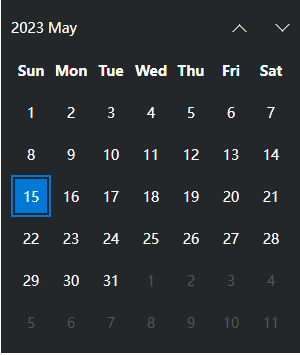
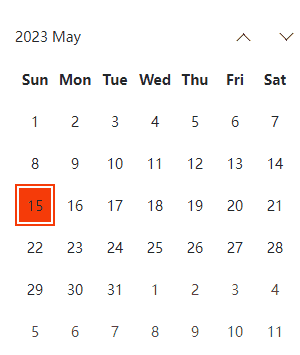
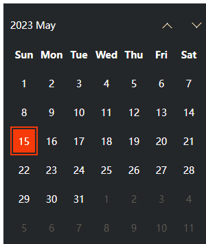

# es-calendar 日历组件

## 介绍

基于 vue3.x + CompositionAPI + typescript + vite + dayjs 模拟windows的日历效果，支持主题切换，自定义高亮颜色、mask区域

用windows的小伙伴应该都见过它的日历小工具，好玩的是它的hover效果，出于好奇今天就来实现一个web版的日历组件

话不多说，开搞。。。

## 目标效果展示

- 默认



- 切换主题、颜色



- mask高亮颜色




[源码地址](https://github.com/vangleer/es-calendar)

## 使用说明

### 安装依赖

```
npm i es-calendar
```

### 全局注册

```typescript
import { createApp } from 'vue'
import App from './App.vue'

import 'es-calendar/dist/style.css'
import Calendar from 'es-calendar'

createApp(App)
  .component('es-calendar', Calendar)
  .mount('#app')
```

- 使用

```html
<template>
  <es-calendar v-model="date" />
</template>
<script lang="ts" setup>
import { ref } from 'vue'

const date = ref(new Date())
</script>
```

### 组件中直接使用

```html
<template>
  <Calendar v-model="date" />
</template>

<script setup lang='ts'>
import Calendar from 'es-calendar'
import { ref } from 'vue'

const date = ref(new Date())
</script>
```

## 具体实现

### 数据准备

```typescript
// calendar.ts
import type { Dayjs } from 'dayjs'

export function createNamespace(name: string) {
  const namespace = `es-${name}`

  const createBEM = (suffix?: string): string => {
    if (!suffix) return namespace
    return suffix.startsWith('--')
      ? `${namespace}${suffix}`
      : `${namespace}__${suffix}`
  }

  return {
    n: createBEM
  }
}

export type DateCellType = 'normal' | 'today' | 'week' | 'next-month' | 'prev-month'
export interface DateCell {
  text?: number
  isSelected?: boolean
  date: Dayjs,
  type?: DateCellType
}
```

```typescript
import { DateCellType, DateCell, createNamespace } from './calendar'
import { computed, ref } from 'vue'
import dayjs, { Dayjs } from 'dayjs'
import localeData from 'dayjs/plugin/localeData.js'
dayjs.extend(localeData)

const props = defineProps({
  modelValue: [String, Number, Date]
})
const emit = defineEmits(['update:modelValue'])
const { n } = createNamespace('calendar')

const title = computed(() => date.value.get('year') + ' ' + date.value.format('MMMM'))

const selectedDay = ref<Dayjs>()
const date = computed<Dayjs>({
  get: () => {
    return props.modelValue ? dayjs(props.modelValue) : dayjs(selectedDay.value)
  },
  set: (val) => {
    selectedDay.value = val
    emit('update:modelValue', val.toDate())
  }
})
const tableRows = ref<DateCell[][]>([[], [], [], [], [], []])

// 使用dayjs获取weekdays
const WEEKS_CONSTANT = computed(() => date.value
  .locale('en')
  .localeData()
  .weekdaysShort()
  .map((_) => _.toLowerCase())
)

// 表头数据
const WEEKS = computed(() => WEEKS_CONSTANT.value.map(w => w[0].toUpperCase() + w.substring(1)))

// 表格开始日期
const startDate = computed(() => {
  const startDayOfMonth = date.value.startOf('month')
  return startDayOfMonth.subtract(startDayOfMonth.day() || 7, 'day')
})

// 表格数据
const rows = computed(() => {
  const rows_ = tableRows.value
  const cols = WEEKS.value.length

  // 当前选中的日期
  const cur = date.value
  // 当月第一天
  const monthstartDay = cur.startOf('month').day()
  // 当月最后一天
  const lastDate = cur.endOf('month').date()

  let count = 1
  // 循环填充表格，6行7列
  for (let row = 0; row < tableRows.value.length; row++) {
    for (let col = 0; col < cols; col++) {
      const cellDate = startDate.value.add(count, 'day')
      const text = cellDate.date()
      // 是否选中
      const isSelected = cellDate.format('YYYY-MM-DD') === date.value.format('YYYY-MM-DD')
      // 默认当月日期
      let type: DateCellType = 'normal'
      if (count < monthstartDay) { // 上个月日期
        type = 'prev-month'
      } else if (count - monthstartDay >= lastDate) { // 下个月日期
        type = 'next-month'
      }

      rows_[row][col] = {
        type,
        date: cellDate,
        text,
        isSelected
      }
      count++
    }
  }

  return rows_
})
```

- 首先使用dayjs获取到WEEKS，也就是表头数据（星期的名称）
- 日期表格为6行7列，42个天数
- 使用计算属性得到开始的日期 startDate，例如：这个月第一天是礼拜3，那么表格开始日期就要往前退3天，使用dayjs的subtract减去就得到开始日期

```typescript
const startDate = computed(() => {
  const startDayOfMonth = date.value.startOf('month')
  console.log(startDayOfMonth.day())
  return startDayOfMonth.subtract(startDayOfMonth.day() || 7, 'day')
})
```

- 有了开始日期，就可循环得到表格每项的日期了，定义一个计数变量 count，每次循环使用startDate加上 count 即可

### 模板和样式

```html
<template>
  <div :class="n()">
    <div
      :class="n('body')"
    >
      <table
        :class="n('table')"
        cellpadding="0"
        cellspacing="0"
      >
        <tbody>
          <tr>
            <th v-for="item in WEEKS" :aria-label="item + ''" scope="col">
              <div :class="n('col-title')">{{ item }}</div>
            </th>
          </tr>
          <tr v-for="row, rowKey in rows" :key="rowKey">
            <td
              v-for="col, colKey in row"
              :key="`${rowKey + colKey}`"
              :class="[n('col'), col.type, { selected: col.isSelected }]"
            >
              <div :class="n('col-wrap')">
                <div :class="n('col-wrap-box')">
                  <div :class="n('col-inner')">
                    {{ col.text }}
                  </div>
                </div>
              </div>
            </td>
          </tr>
        </tbody>
      </table>
    </div>
  </div>
</template>

<style lang='scss' scoped>
* {
  margin: 0;
  padding: 0;
  box-sizing: border-box;
}
.es-calendar {
  --es-calendar-light-bg: #fff;
  --es-calendar-black-bg: #242729;
  --es-calendar-light-color: #242729;
  --es-calendar-black-color: #fff;

  --es-color-primary: #0078d7;
  --es-text-color: var(--es-calendar-black-color);
  --es-calendar-mask-color: #818383;
  --es-calendar-color-bg: var(--es-calendar-black-bg);

  width: 300px;
  background-color: var(--es-calendar-color-bg);
  color: var(--es-text-color);
  padding: 10px;
  font-size: 14px;
  
  &__body {
    position: relative;
    overflow: hidden;
  }
  
  &__table {
    position: relative;
    width: 100%;
    background-color: var(--es-calendar-color-bg);
  }
  th {
    position: relative;
    width: 42px;
    height: 42px;
  }
  &__col-title {
    position: absolute;
    top: 0;
    left: 0;
    display: flex;
    justify-content: center;
    align-items: center;
    z-index: 2;
    width: 100%;
    height: 100%;
    background-color: var(--es-calendar-color-bg);
  }
  &__col {
    position: relative;
    width: 42px;
    height: 42px;
    font-size: 14px;
    &.selected {
      .es-calendar__col-wrap {
        border: 2px solid var(--es-color-primary);
        .es-calendar__col-wrap-box {
          border-color: var(--es-calendar-color-bg);
        }
        .es-calendar__col-inner {
          background-color: var(--es-color-primary);
        }
      }
    }

    &.next-month, &.prev-month {
      color: #5b5b5b;
    }
  }
  &__col-wrap {
    position: absolute;
    top: 0;
    left: 0;
    z-index: 1;
    display: flex;
    justify-content: center;
    align-items: center;
    width: 100%;
    height: 100%;
    border: 1px solid var(--es-calendar-color-bg);
    cursor: pointer;
    &:hover {
      .es-calendar__col-wrap-box {
        border-color: var(--es-calendar-mask-color);
      }
    }
    &-box {
      width: 100%;
      height: 100%;
      border: 2px solid transparent;
    }

    .es-calendar__col-inner {
      width: 100%;
      height: 100%;
      background-color: var(--es-calendar-color-bg);
      display: flex;
      justify-content: center;
      align-items: center;
    }
  }
}

</style>
```

- 使用样式变量是为了自定义主题
- 样式只关注日期单元格，这里使用3个div嵌套也是为了实现类似windows日期的hover效果

hover实现的逻辑
    
  1. 鼠标经过显示mask层（后面会讲）并跟着鼠标移动，父盒子设置溢出隐藏。 
  2. 日期单元格设置为绝对定位覆盖mask（注意：如果单元格没有背景颜色或者背景颜色为透明还是会显示mask）。
  3. 第一个div(col-wrap)设置1像素带颜色的border
  4. 第二个div(col-wrap-box)设置2像素的border，但是颜色为透明，这样就可以将mask显示出来了
  5. 第三个div(col-inner)设置宽高100%并设置背景颜色。
  6. 这样当mask显示时，透明边框就会填充为mask的颜色了

```html
<div :class="n('col-wrap')">
  <div :class="n('col-wrap-box')">
    <div :class="n('col-inner')">
      {{ col.text }}
    </div>
  </div>
</div>
```

### mask功能实现

```

```

- 在body中（与table同级）添加mask标签，mask 是个圆形，背景颜色设置为径向渐变
```html
<div
  :class="n('body')"
  ref="wrapRef"
  @mousemove="onMousemove"
  @mouseenter="showMask = true"
  @mouseleave="showMask = false"
>
  <table>...</table>
  <div
    v-show="showMask"
    ref="maskRef"
    :class="n('mask')"
    :style="maskPosition"
  >
  </div>
</div>

<style lang='scss' scoped>
.es-calendar {
  --es-calendar-mask-color: #818383;
  --es-calendar-mask-size: 150px;
  &__mask {
    position: absolute;
    width: var(--es-calendar-mask-size);
    height: var(--es-calendar-mask-size);
    background: radial-gradient(var(--es-calendar-mask-color) 0px, transparent calc(var(--es-calendar-mask-size) / 2.5));
  }
}
  
</style>
```

- 逻辑部分，这块比较简单直接上代码

```typescript
const wrapRef = ref<HTMLElement>()
const maskRef = ref<HTMLElement>()
const showMask = ref(false)
const maskPosition = ref({
  left: '0px',
  top: '0px'
})
const wrapRect = computed(() => wrapRef.value!.getBoundingClientRect())
const maskRect = computed(() => maskRef.value!.getBoundingClientRect())

// 鼠标移动计算mask的位置
const onMousemove = (e: MouseEvent) => {
  const x = e.clientX - wrapRect.value.left - maskRect.value.width / 2
  const y = e.clientY - wrapRect.value.top - maskRect.value.height / 2
  maskPosition.value = { left: x + 'px', top: y + 'px' }
}
```

## 主题切换

由于上面样式颜色都定义好了样式变量，这节就只管定义props和组装样式就行了

```typescript
type ThemeType = 'black' | 'light'
const props = defineProps({
  modelValue: [String, Number, Date],
  theme: {
    type: String as PropType<ThemeType>,
    default: 'black'
  },
  color: {
    type: String,
    default: '#0078d7'
  },
  maskColor: {
    type: String,
    default: '#818383'
  },
  maskSize: {
    type: Number,
    default: 150
  }
})

const calendarStyle = computed(() => ({
  '--es-calendar-color-bg': `var(--es-calendar-${props.theme}-bg)`,
  '--es-color-primary': props.color,
  '--es-text-color': `var(--es-calendar-${props.theme}-color)`,
  '--es-calendar-mask-color': props.maskColor,
  '--es-calendar-mask-size': props.maskSize + 'px',
}))

```

将 calendarStyle 给顶层元素即可

## 最后

想要源码的小伙伴可直接到 [github仓库](https://github.com/vangleer/es-calendar) 获取

点个赞再走呗！！！(●'◡'●)